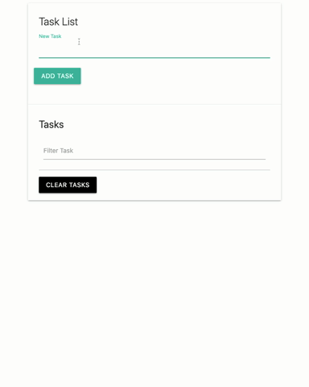
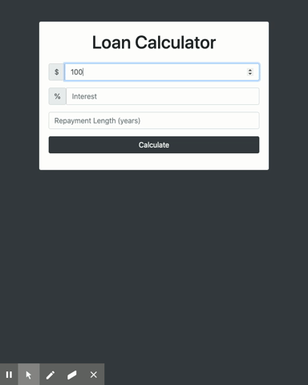

# dom-projects
Vanilla JS DOM Manipulation Practice

### Github Finder
This application allows users to search for Github profiles, returning the searched users profile, repositories, followers, and who they're following

### Weather App
This weather application allows users to search the weather of any city, utilzing the openWeather API

### Task List
Simple app that adds and deletes tasks to and from Local Storage

### Loan Calculator
Simple app calculates loan monthly payments and total interest over the life of the loan

### Book List
Simple app that adds and deletes books

